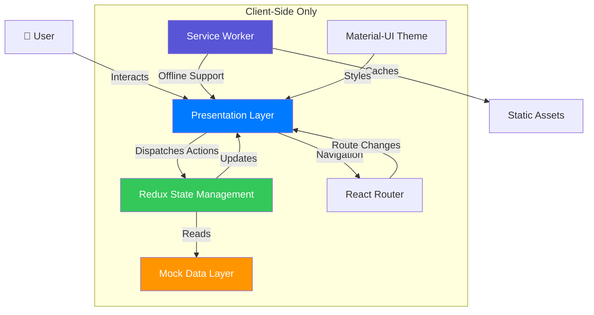
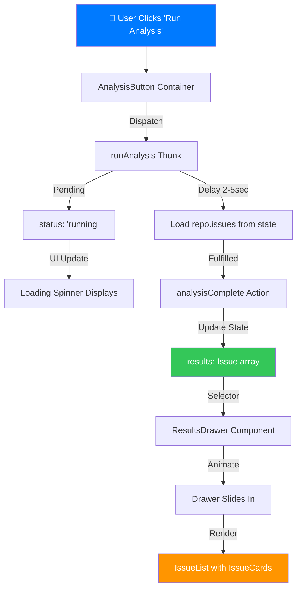
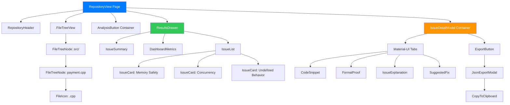
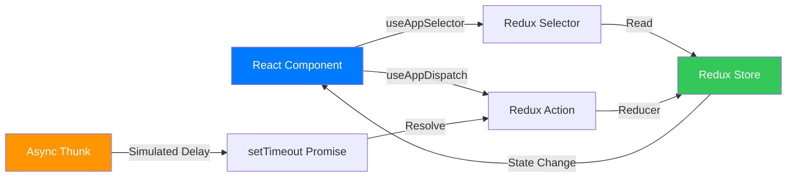
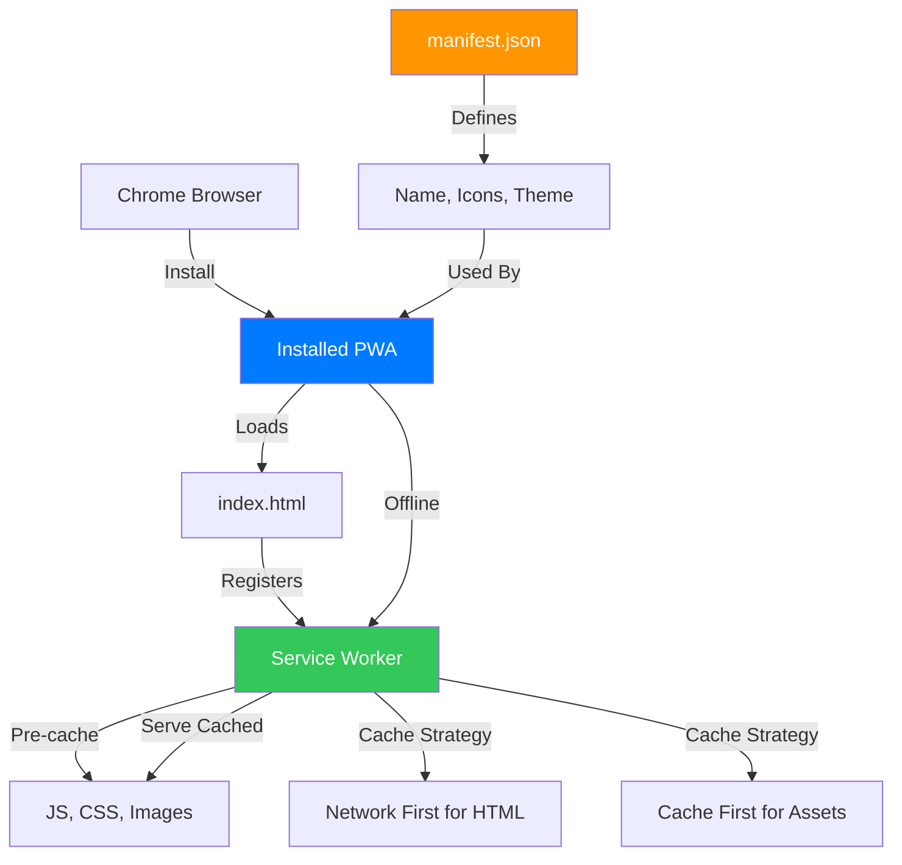

# Technical Architecture: C++ Grinding Mockup - Formal Verification Linter

**Version**: 1.0
**Date**: 2024-12-02
**Based on**: PRD v1.0
**Architecture Philosophy**: Vertical Slices, SOLID, KISS, DRY, YAGNI, TRIZ, Emergent Design

---

## Table of Contents

1. [Overview & Philosophy](#overview--philosophy)
2. [Vertical Slices Breakdown](#vertical-slices-breakdown)
3. [Component Hierarchy](#component-hierarchy)
4. [State Management Design](#state-management-design)
5. [Cross-Cutting Concerns](#cross-cutting-concerns)
6. [Architectural Decisions](#architectural-decisions)
7. [Implementation Order](#implementation-order)
8. [Key Patterns & Conventions](#key-patterns--conventions)
9. [Architecture Diagrams](#architecture-diagrams)

---

## Overview & Philosophy

### Architecture Vision

This architecture transforms the PRD into a production-ready, maintainable codebase using modern software engineering principles. The system is organized by **vertical slices** (complete user flows) rather than technical layers, enabling independent feature development and clear business value mapping.

### Guiding Principles Applied

- **Vertical Slices**: Each feature represents a complete user journey from UI to data
- **SOLID**: Component boundaries follow Single Responsibility, Open/Closed, Dependency Inversion
- **KISS**: Prefer platform capabilities and simple solutions over custom abstractions
- **DRY**: Extract truly repeated logic, but avoid premature abstraction
- **YAGNI**: Build only what the PRD requires - no speculative features
- **TRIZ Ideal Final Result**: Leverage React/Redux/Material-UI capabilities to minimize custom code
- **Emergent Design**: Start simple, let patterns emerge from implementation

### Tech Stack Rationale

| Technology | Rationale | Principle |
|------------|-----------|-----------|
| **React 18 + TypeScript** | Type safety prevents runtime errors in demo (critical for investor pitch). Strong typing catches bugs before they reach production. | **Type Safety First**, **KISS** (use proven framework) |
| **Redux Toolkit** | PRD requirement + manages complex state across slices (connection status, repos, analysis results). Toolkit reduces boilerplate vs vanilla Redux. | **DRY** (centralized state), **SOLID-SRP** (state logic separated from UI) |
| **Material-UI v5** | Professional baseline components customizable to macOS aesthetic. Avoids building UI primitives from scratch. | **TRIZ-IFR** (use existing solution), **YAGNI** (don't build what exists) |
| **Workbox (PWA)** | Service worker generation with minimal config. Offline support without manual SW code. | **KISS** (leverage tooling), **YAGNI** (build-time generation) |
| **Vite** | Fast dev server, optimized builds, minimal config. Superior DX for tight timeline. | **KISS** (convention over config) |

### System Constraints

- **No Backend**: Pure client-side simulation, all data hardcoded in Redux
- **Chrome-First**: Optimized for Chrome PWA install and Zoom screenshare
- **macOS Aesthetic**: SF Pro font, subtle shadows, smooth animations, spacious layout
- **Light Mode Only**: No dark mode for MVP
- **Demo Timeline**: Must work flawlessly tomorrow

---

## Vertical Slices Breakdown

Vertical slices organized by complete user workflows, not technical layers. Each slice crosses presentation → state → data layers.

### Slice 1: Install and Launch App

**User Goal**: Install PWA and launch as standalone app to experience professional product feel

**User Flow**:
1. User opens localhost in Chrome
2. Sees PWA install prompt
3. Installs app to macOS dock
4. Launches as standalone window
5. App works offline

**Components Involved**:
- `public/manifest.json` (PWA configuration)
- `src/serviceWorkerRegistration.ts` (Workbox integration)
- `public/icons/` (app icons 192x192, 512x512)
- Root HTML with manifest link

**State Requirements**: None (platform-managed)

**TRIZ-IFR Application**:
- **Ideal**: PWA works without custom code
- **Solution**: Use Workbox plugin for Vite to auto-generate service worker
- **Principle**: YAGNI - don't hand-write SW if tooling provides it

**Acceptance**:
- Installs from Chrome successfully
- Launches standalone (no browser chrome)
- Works offline after initial load
- Hupyy branding visible in icon

---

### Slice 2: Connect to GitHub

**User Goal**: Understand product purpose and simulate GitHub connection to enter demo workflow

**User Flow**:
1. App loads to landing page
2. User sees Hupyy branding + tagline ("AI Firewall for Code Verification")
3. Clicks "Connect to GitHub" button
4. Sees loading animation (1-2 sec)
5. Transitions to repository dashboard

**Components Involved**:
- `LandingPage` (presentation component)
- `ConnectButton` (container component handling state)
- `LoadingSpinner` (reusable UI component)
- `AppRouter` (navigation)

**State Requirements**:
- `connectionStatus`: enum ('disconnected' | 'connecting' | 'connected')
- Redux action: `connectToGitHub()` (simulated async)
- Redux selector: `selectConnectionStatus()`

**SOLID Application**:
- **SRP**: `LandingPage` only renders UI, `ConnectButton` manages connection state
- **OCP**: Connection logic in Redux slice, extensible to real GitHub OAuth later
- **DIP**: Components depend on Redux abstractions, not hardcoded state

**KISS Application**:
- Simulated delay with `setTimeout` (no complex async library needed)
- Direct Redux dispatch (no middleware saga/thunk complexity for demo)

**Acceptance**:
- macOS aesthetic with SF Pro-like font
- Smooth loading animation
- Clean transition to dashboard
- Zero console errors

---

### Slice 3: Select Repository

**User Goal**: Choose between high-profile repos to demonstrate tool versatility

**User Flow**:
1. Dashboard shows "Connected to GitHub" status
2. Two repo cards displayed: "stripe/payment-gateway", "meta/compiler-optimizer"
3. Each card shows metadata (language, description, activity)
4. User clicks repo card
5. Smooth transition to file tree view

**Components Involved**:
- `RepositoryDashboard` (presentation)
- `RepositoryCard` (reusable component)
- `RepositorySelector` (container)
- `AppRouter` (navigation to `/repo/:repoId`)

**State Requirements**:
- `repositories`: array of repo objects (hardcoded in initial state)
  ```typescript
  interface Repository {
    id: string
    name: string
    owner: string
    language: string
    description: string
    fileTree: FileNode[]
    issues: Issue[]
  }
  ```
- `selectedRepoId`: string | null
- Redux action: `selectRepository(repoId: string)`
- Redux selector: `selectSelectedRepository()`

**SOLID Application**:
- **SRP**: `RepositoryCard` renders single repo, `RepositorySelector` handles selection logic
- **ISP**: Repo card only receives display props, not full repo object
- **LSP**: All repo objects interchangeable (same interface)

**DRY Application**:
- Single `RepositoryCard` component reused for both repos
- Shared metadata display pattern

**Acceptance**:
- Two repos clearly visible
- Hover states on cards
- Metadata displays correctly
- Selection triggers navigation

---

### Slice 4: Browse Project Structure

**User Goal**: See realistic C++ project structure for context before running analysis

**User Flow**:
1. After selecting repo, file tree displays
2. Tree shows realistic structure (src/, include/, tests/)
3. Folders are collapsible/expandable
4. File type icons visible
5. Ready for analysis

**Components Involved**:
- `FileTreeView` (presentation)
- `FileTreeNode` (recursive component)
- `FileIcon` (maps extension to icon)
- `RepositoryLayout` (layout component)

**State Requirements**:
- File tree data stored in `repositories[].fileTree`
  ```typescript
  interface FileNode {
    name: string
    type: 'file' | 'folder'
    path: string
    children?: FileNode[]
  }
  ```
- `expandedFolders`: Set<string> (local component state, not Redux)

**SOLID Application**:
- **SRP**: `FileTreeNode` renders one node, recursion handles tree
- **OCP**: File tree structure extensible (can add metadata later)
- **DIP**: Component depends on `FileNode` interface, not concrete data

**KISS Application**:
- Use Material-UI `TreeView` component (don't build from scratch)
- Folder expansion in local state (no need for Redux complexity)

**YAGNI Application**:
- Files NOT clickable/openable (PRD says out of scope)
- No file content viewing (deferred to future)

**Acceptance**:
- Realistic C++ structure (10-20 files)
- Collapsible folders
- File type icons
- macOS tree aesthetic

---

### Slice 5: Verify Code (Run Analysis)

**User Goal**: Trigger formal verification and see results

**User Flow**:
1. User sees "Run Formal Verification" button
2. Clicks button
3. Button shows "Analyzing..." with spinner (2-5 sec)
4. Progress animation
5. Completion state
6. Results drawer slides in

**Components Involved**:
- `AnalysisButton` (container component)
- `LoadingProgress` (reusable component)
- `ResultsDrawer` (presentation component)
- `IssueList` (presentation component)
- `IssueSummary` (component)

**State Requirements**:
- `analysisStatus`: enum ('idle' | 'running' | 'complete' | 'error')
- `analysisResults`: Issue[] (populated after "analysis")
- Redux action: `runAnalysis(repoId: string)` (simulated async)
- Redux action: `analysisComplete(issues: Issue[])`
- Redux selector: `selectAnalysisResults()`

**SOLID Application**:
- **SRP**: Button manages trigger, drawer manages display, separate concerns
- **OCP**: Analysis action extensible to real backend later
- **DIP**: Components depend on Redux state, not hardcoded results

**KISS Application**:
- Simulated delay with `setTimeout` (2-5 sec)
- Issues loaded from hardcoded data in Redux initial state

**Acceptance**:
- Button clearly actionable
- Loading state realistic (not instant)
- Drawer slides smoothly
- 3-5 issues displayed
- All bug categories represented

---

### Slice 6: Investigate Issues

**User Goal**: See comprehensive issue details including formal proofs and fixes

**User Flow**:
1. User clicks issue in list
2. Issue detail expands (modal or accordion)
3. Tabs/sections show:
   - Code snippet (C++ with syntax highlighting)
   - Formal proof (SMT-LIB/cvc5 syntax)
   - Simplified proof visualization
   - Human-readable explanation
   - Suggested fix (before/after)
4. "Verified by cvc5" badge visible
5. User closes to return to list

**Components Involved**:
- `IssueDetailModal` (container)
- `CodeSnippet` (syntax highlighting component)
- `FormalProof` (formatted SMT-LIB display)
- `ProofVisualization` (simplified diagram)
- `IssueExplanation` (markdown-rendered text)
- `SuggestedFix` (code diff component)
- `TabPanel` (Material-UI tabs)

**State Requirements**:
- `selectedIssueId`: string | null
- Redux action: `selectIssue(issueId: string)`
- Redux selector: `selectIssueById(issueId: string)`
- Issue structure:
  ```typescript
  interface Issue {
    id: string
    severity: 'critical' | 'high' | 'medium' | 'low'
    category: 'memory-safety' | 'concurrency' | 'undefined-behavior' | 'type-safety'
    file: string
    line: number
    title: string
    description: string
    codeSnippet: string
    smt liLibProof: string
    simplifiedProof: string
    explanation: string
    suggestedFix: string
  }
  ```

**SOLID Application**:
- **SRP**: Each tab renders one view (code, proof, explanation, fix)
- **ISP**: Tab components receive only relevant props
- **OCP**: Tab structure extensible (can add more views)

**DRY Application**:
- Single `CodeSnippet` component reused for code and fix
- Shared syntax highlighting logic

**TRIZ-IFR Application**:
- Use existing syntax highlighting library (Prism.js or highlight.js)
- Use Material-UI `Tabs` instead of custom tabs

**Acceptance**:
- Code syntax highlighted
- SMT-LIB proof plausible (doesn't need to be 100% valid)
- "Verified by cvc5" badge prominent
- Explanation clear and jargon-free
- Fix shows specific code change

---

### Slice 7: Export for AI Integration

**User Goal**: Demonstrate "AI firewall" concept with JSON export and metrics

**User Flow - Export**:
1. User viewing issue details
2. Sees "Export for AI Agent" button
3. Clicks button
4. Modal shows formatted JSON
5. Copy button copies to clipboard
6. Explanation text visible

**User Flow - Metrics**:
1. Dashboard/results header shows metric card
2. "Blocked X AI-Generated Bugs" displayed
3. Shield icon and success color

**Components Involved**:
- `ExportButton` (container)
- `JsonExportModal` (presentation)
- `CopyToClipboard` (reusable utility component)
- `MetricCard` (reusable component)
- `DashboardMetrics` (container)

**State Requirements**:
- No new state (uses existing `analysisResults`)
- Derived selector: `selectTotalIssueCount()` (counts issues)
- JSON serialization function in utils

**SOLID Application**:
- **SRP**: Export button triggers modal, modal displays JSON, clipboard handles copy
- **OCP**: JSON format defined by interface, extensible

**KISS Application**:
- Use browser Clipboard API (no library needed)
- JSON.stringify for formatting (no custom serializer)

**DRY Application**:
- Metric count derived from existing state (don't duplicate)

**Acceptance**:
- JSON properly formatted
- Copy to clipboard works
- Metric displays total count
- "AI firewall" messaging clear

---

## Component Hierarchy

### Overall Component Architecture

```
App (Root)
├── AppRouter (React Router)
│   ├── LandingPage
│   │   ├── Header (Hupyy branding)
│   │   ├── Hero (tagline)
│   │   └── ConnectButton
│   ├── RepositoryDashboard
│   │   ├── ConnectionStatus
│   │   └── RepositoryList
│   │       └── RepositoryCard (×2)
│   └── RepositoryView
│       ├── RepositoryHeader
│       ├── FileTreeView
│       │   └── FileTreeNode (recursive)
│       │       └── FileIcon
│       ├── AnalysisButton
│       ├── ResultsDrawer
│       │   ├── IssueSummary
│       │   ├── DashboardMetrics
│       │   └── IssueList
│       │       └── IssueCard (×3-5)
│       └── IssueDetailModal
│           ├── TabPanel
│           │   ├── CodeSnippet
│           │   ├── FormalProof
│           │   ├── ProofVisualization
│           │   ├── IssueExplanation
│           │   └── SuggestedFix
│           └── ExportButton
│               └── JsonExportModal
│                   └── CopyToClipboard
└── ServiceWorkerWrapper
```

### Component Categories

**Presentation Components** (Pure UI, no state):
- `LandingPage`, `RepositoryCard`, `FileTreeNode`, `IssueCard`, `CodeSnippet`, `FormalProof`, `IssueExplanation`, `SuggestedFix`, `MetricCard`, `ConnectionStatus`, `IssueSummary`

**Container Components** (State management):
- `ConnectButton`, `RepositorySelector`, `AnalysisButton`, `IssueDetailModal`, `ExportButton`, `DashboardMetrics`

**Layout Components** (Structure):
- `RepositoryView`, `ResultsDrawer`, `Header`, `AppRouter`

**Utility Components** (Reusable):
- `LoadingSpinner`, `LoadingProgress`, `FileIcon`, `CopyToClipboard`, `TabPanel`

### Component Design Principles

**Principle: Single Responsibility**
- Each component has ONE reason to change
- Example: `AnalysisButton` triggers analysis, `ResultsDrawer` displays results (not combined)

**Principle: Presentation/Container Pattern**
- Presentation: Receives props, renders UI (pure functions)
- Container: Connects to Redux, manages state, passes props to presentation
- Example: `IssueCard` (presentation) vs `IssueDetailModal` (container)

**Principle: Composition Over Inheritance**
- Build complex UIs by composing small components
- Example: `IssueDetailModal` composes `CodeSnippet`, `FormalProof`, `IssueExplanation`

**Principle: KISS - Use Material-UI**
- Don't build primitives: use `Button`, `Card`, `Drawer`, `Tabs`, `Modal`
- Customize theme for macOS aesthetic (spacing, shadows, font)

---

## State Management Design

### Redux Store Structure

```typescript
interface RootState {
  connection: ConnectionState
  repositories: RepositoriesState
  analysis: AnalysisState
  ui: UIState
}

interface ConnectionState {
  status: 'disconnected' | 'connecting' | 'connected'
}

interface RepositoriesState {
  repositories: Repository[]  // Hardcoded in initial state
  selectedRepoId: string | null
}

interface AnalysisState {
  status: 'idle' | 'running' | 'complete' | 'error'
  results: Issue[] | null
  selectedIssueId: string | null
}

interface UIState {
  drawerOpen: boolean
  exportModalOpen: boolean
}
```

### Redux Slices (Redux Toolkit)

**Slice 1: connectionSlice**
- State: `connectionStatus`
- Actions: `connectToGitHub()`, `connectionSuccess()`
- Thunk: Simulated delay (1-2 sec), then dispatch success

**Slice 2: repositoriesSlice**
- State: `repositories`, `selectedRepoId`
- Actions: `selectRepository(repoId)`, `clearSelection()`
- Initial state: Hardcoded array with stripe and meta repos

**Slice 3: analysisSlice**
- State: `status`, `results`, `selectedIssueId`
- Actions: `startAnalysis()`, `analysisComplete(issues)`, `selectIssue(id)`, `clearSelection()`
- Thunk: Simulated delay (2-5 sec), then load issues from repo data

**Slice 4: uiSlice**
- State: `drawerOpen`, `exportModalOpen`
- Actions: `openDrawer()`, `closeDrawer()`, `openExportModal()`, `closeExportModal()`

### Selectors (Reselect for memoization)

```typescript
// Basic selectors
export const selectConnectionStatus = (state: RootState) => state.connection.status
export const selectSelectedRepoId = (state: RootState) => state.repositories.selectedRepoId
export const selectAnalysisResults = (state: RootState) => state.analysis.results
export const selectSelectedIssueId = (state: RootState) => state.analysis.selectedIssueId

// Derived selectors (memoized)
export const selectSelectedRepository = createSelector(
  [selectSelectedRepoId, (state: RootState) => state.repositories.repositories],
  (selectedId, repos) => repos.find(r => r.id === selectedId) ?? null
)

export const selectSelectedIssue = createSelector(
  [selectSelectedIssueId, selectAnalysisResults],
  (selectedId, results) => results?.find(i => i.id === selectedId) ?? null
)

export const selectTotalIssueCount = createSelector(
  [selectAnalysisResults],
  (results) => results?.length ?? 0
)

export const selectIssuesByCategory = createSelector(
  [selectAnalysisResults],
  (results) => {
    const grouped: Record<string, Issue[]> = {}
    results?.forEach(issue => {
      if (!grouped[issue.category]) grouped[issue.category] = []
      grouped[issue.category].push(issue)
    })
    return grouped
  }
)
```

### State Management Principles

**Principle: SOLID - SRP**
- Each slice manages ONE domain (connection, repos, analysis, UI)
- Slices don't cross-reference (selectors handle composition)

**Principle: DRY**
- Derived data computed with selectors (not duplicated in state)
- Example: Total issue count derived from `results.length`, not stored separately

**Principle: KISS**
- Use Redux Toolkit (reduces boilerplate vs vanilla Redux)
- Simulated async with simple thunks (no saga/observable complexity)

**Principle: YAGNI**
- No persistence (localStorage out of scope for demo)
- No history/undo (not in PRD)
- No user preferences (not needed)

**Principle: Immutability**
- Redux Toolkit uses Immer (write "mutable" code, get immutable updates)
- Type safety prevents direct state mutation

---

## Cross-Cutting Concerns

### Routing

**Library**: React Router v6

**Routes**:
- `/` - LandingPage
- `/dashboard` - RepositoryDashboard (after connection)
- `/repo/:repoId` - RepositoryView (selected repo)

**Navigation Flow**:
1. Landing → Dashboard (on connect)
2. Dashboard → Repo View (on repo select)

**Principle: KISS**
- Simple route structure (no nested routes, no complex params)
- Use React Router's `useNavigate()` hook for programmatic navigation

**Principle: YAGNI**
- No auth guards (no login required)
- No route animations beyond component transitions

---

### Theming (macOS Aesthetic)

**Approach**: Customize Material-UI theme

**Theme Configuration**:
```typescript
import { createTheme } from '@mui/material/styles'

const theme = createTheme({
  typography: {
    fontFamily: '-apple-system, BlinkMacSystemFont, "SF Pro Text", "Helvetica Neue", Arial, sans-serif',
  },
  palette: {
    mode: 'light',  // Light mode only
    primary: {
      main: '#007AFF',  // macOS blue
    },
    background: {
      default: '#F5F5F7',  // macOS background
      paper: '#FFFFFF',
    },
  },
  shape: {
    borderRadius: 8,  // macOS rounded corners
  },
  shadows: [
    // Subtle macOS-style shadows
    'none',
    '0 1px 3px rgba(0,0,0,0.12)',
    '0 2px 6px rgba(0,0,0,0.12)',
    // ... (customize all 25 shadow levels)
  ],
  components: {
    MuiButton: {
      styleOverrides: {
        root: {
          textTransform: 'none',  // No ALL CAPS
          fontWeight: 500,
        },
      },
    },
    MuiCard: {
      styleOverrides: {
        root: {
          boxShadow: '0 2px 8px rgba(0,0,0,0.1)',
        },
      },
    },
    // ... more component customizations
  },
})
```

**Principle: TRIZ-IFR**
- Use Material-UI theme system (don't write custom CSS framework)
- Customize existing components instead of building from scratch

**Principle: KISS**
- Single theme file, applied globally with `ThemeProvider`
- No theme switching logic (light mode only)

---

### Animations

**Library**: Framer Motion (for complex animations) + CSS transitions (for simple hover states)

**Key Animations**:
- Page transitions: fade + slide (200ms)
- Drawer slide-in: slide from right (300ms, easeInOut)
- Button loading spinner: rotate (continuous)
- Modal open: scale + fade (200ms)

**Principle: KISS**
- Use CSS transitions for simple states (hover, focus)
- Use Framer Motion only for complex sequences (drawer, modal)

**Principle: Performance**
- 60fps target: use `transform` and `opacity` (GPU-accelerated)
- Avoid animating `width`, `height`, `left`, `top` (triggers layout)

---

### Error Handling

**Strategy**: Minimal for demo (no real errors expected)

**Error Boundaries**: React Error Boundary component wrapping app root
- Catches component errors
- Displays fallback UI (not blank screen)

**Redux Error State**: `analysis.status = 'error'` (not used in demo, but defined for completeness)

**Principle: YAGNI**
- No complex error logging (not needed for demo)
- No retry logic (simulated data always succeeds)

---

### PWA Configuration

**manifest.json**:
```json
{
  "name": "Hupyy C++ Formal Verification",
  "short_name": "Hupyy Verifier",
  "description": "AI Firewall for Code Verification",
  "start_url": "/",
  "display": "standalone",
  "background_color": "#F5F5F7",
  "theme_color": "#007AFF",
  "icons": [
    {
      "src": "/icons/icon-192x192.png",
      "sizes": "192x192",
      "type": "image/png"
    },
    {
      "src": "/icons/icon-512x512.png",
      "sizes": "512x512",
      "type": "image/png"
    }
  ]
}
```

**Service Worker**: Workbox plugin (Vite config)
- Cache-first strategy for static assets
- Network-first for index.html
- Pre-cache all build assets

**Principle: TRIZ-IFR**
- Use Workbox tooling (don't write manual SW code)
- Vite plugin handles generation at build time

---

### Offline Support

**Strategy**: Cache all assets on first load

**Data**: Hardcoded in Redux initial state (no API calls to fail offline)

**Principle: KISS**
- No complex sync logic (demo doesn't need it)
- Service worker handles asset caching automatically

---

## Architectural Decisions

### Decision 1: Redux Toolkit for State Management

**Decision**: Use Redux Toolkit with slices, thunks, and Reselect selectors

**Rationale**:
- PRD explicitly requires Redux
- Toolkit reduces boilerplate (vs vanilla Redux)
- Strong typing with TypeScript prevents state errors
- Centralized state easier to debug during demo

**Principle**:
- **SOLID-SRP**: State logic separated from UI components
- **DRY**: Single source of truth for all state
- **Type Safety**: Catch state shape errors at compile time

**Trade-offs**:
- More setup complexity than Context API
- Slight bundle size increase (acceptable for demo)

**Alternatives Considered**:
- Context API (rejected - PRD requires Redux)
- MobX (rejected - team unfamiliarity)
- Zustand (rejected - PRD requires Redux)

---

### Decision 2: Material-UI for Component Library

**Decision**: Use Material-UI v5 with custom macOS theme

**Rationale**:
- Professional baseline components (Button, Card, Drawer, Tabs, Modal)
- Extensive theming system for macOS customization
- Saves development time (critical for timeline)
- Strong TypeScript support

**Principle**:
- **TRIZ-IFR**: Don't build UI primitives if library provides them
- **YAGNI**: Don't build custom component library for one demo
- **KISS**: Theme customization simpler than building from scratch

**Trade-offs**:
- Bundle size (acceptable - no mobile target)
- Some macOS customization needed (shadows, spacing)

**Alternatives Considered**:
- Tailwind CSS (rejected - more manual styling work)
- Custom CSS (rejected - too time-consuming)
- Chakra UI (rejected - less macOS-friendly out of box)

---

### Decision 3: Simulated Async with setTimeout

**Decision**: Use `setTimeout` in Redux thunks to simulate GitHub connection and analysis

**Rationale**:
- Simple, no external dependencies
- Realistic delay feels authentic (not instant)
- Easy to control timing (1-2 sec connect, 2-5 sec analysis)

**Principle**:
- **KISS**: Simplest solution that meets requirement
- **YAGNI**: No need for mock API server for demo

**Trade-offs**:
- Not easily extensible to real backend (but that's future work)

**Alternatives Considered**:
- MSW (Mock Service Worker) (rejected - overkill for demo)
- Real localhost API (rejected - PRD says no backend)

---

### Decision 4: Hardcoded Mock Data in Redux Initial State

**Decision**: Store all mock data (repos, issues, code snippets, proofs) in Redux initial state, not external JSON files

**Rationale**:
- Type-safe (TypeScript interfaces enforce structure)
- No fetch errors (data always available)
- Easy to modify during development
- Works offline immediately

**Principle**:
- **KISS**: Data co-located with state management
- **YAGNI**: No need for data fetching abstraction
- **Type Safety**: Compile-time checks for data shape

**Trade-offs**:
- Large initial state file (acceptable - not splitting code)

**Alternatives Considered**:
- JSON files in `public/` (rejected - adds fetch complexity)
- Separate mock data module (considered equivalent, chose Redux for centralization)

---

### Decision 5: Framer Motion for Complex Animations

**Decision**: Use Framer Motion for drawer, modal, page transitions; CSS for simple hovers

**Rationale**:
- Declarative animation API (easier than manual CSS)
- Built-in gesture support (drag, tap)
- Spring physics for natural motion
- TypeScript support

**Principle**:
- **KISS**: Library handles complexity of animation orchestration
- **TRIZ-IFR**: Use existing animation system instead of manual keyframes

**Trade-offs**:
- Bundle size increase (acceptable - desktop demo)

**Alternatives Considered**:
- React Spring (rejected - less intuitive API)
- CSS animations only (rejected - complex for drawer/modal)
- GSAP (rejected - more complexity than needed)

---

### Decision 6: Vite for Build Tool

**Decision**: Use Vite instead of Create React App

**Rationale**:
- Faster dev server (HMR in <50ms vs seconds)
- Simpler config (Vite is zero-config for React + TS)
- Better PWA plugin support (vite-plugin-pwa)
- Modern build (ES modules, Rollup)

**Principle**:
- **KISS**: Minimal configuration needed
- **Performance**: Fast iteration critical for tight timeline

**Trade-offs**:
- Less familiar than CRA (but team comfortable with modern tools)

**Alternatives Considered**:
- Create React App (rejected - slower, being deprecated)
- Next.js (rejected - overkill for SPA, no SSR needed)

---

### Decision 7: Presentation/Container Pattern

**Decision**: Separate presentation components (pure UI) from container components (Redux-connected)

**Rationale**:
- Easier testing (presentation components are pure functions)
- Clearer separation of concerns
- Reusability (presentation components not tied to Redux)

**Principle**:
- **SOLID-SRP**: Presentation renders UI, container manages state
- **SOLID-DIP**: Presentation depends on props interface, not Redux

**Trade-offs**:
- More files (but clearer organization)

**Alternatives Considered**:
- Hooks everywhere (rejected - loses clear boundary between UI and logic)
- All components as containers (rejected - harder to test and reuse)

---

### Decision 8: No LocalStorage Persistence

**Decision**: State resets on page reload (no localStorage persistence)

**Rationale**:
- PRD says out of scope
- Demo is single-session (no need to persist)
- Simpler implementation (no serialization/hydration)

**Principle**:
- **YAGNI**: Don't build what's not in PRD
- **KISS**: Avoid complexity of state hydration

**Trade-offs**:
- User loses state on refresh (acceptable for demo)

---

## Implementation Order

Organized by dependencies and risk. Build foundation first, then vertical slices in priority order.

### Phase 1: Foundation (Day 1 Morning - 2 hours)

**Priority**: Critical path - everything depends on this

1. **Project Setup**
   - Initialize Vite + React + TypeScript
   - Install dependencies: Redux Toolkit, React Router, Material-UI, Framer Motion
   - Configure TypeScript (strict mode, path aliases)
   - Set up ESLint + Prettier

2. **Redux Store Setup**
   - Create store configuration
   - Define RootState interface
   - Set up Redux DevTools

3. **Material-UI Theme**
   - Create macOS theme configuration
   - Apply ThemeProvider at app root
   - Test theme with sample components

4. **Routing Structure**
   - Set up React Router
   - Create route placeholders (/, /dashboard, /repo/:id)
   - Test navigation flow

**Acceptance**: App runs, routing works, theme applies, Redux DevTools shows store

**Principle**: Build on solid foundation (no refactoring later)

---

### Phase 2: PWA Configuration (Day 1 Morning - 1 hour)

**Priority**: High - critical for demo, but independent of features

5. **PWA Setup**
   - Create manifest.json (Hupyy branding)
   - Install vite-plugin-pwa
   - Configure Workbox in Vite config
   - Create app icons (192x192, 512x512)
   - Test PWA install in Chrome

**Acceptance**: App installs from Chrome, launches standalone, works offline

**Principle**: Handle infrastructure early (reduces risk)

---

### Phase 3: Mock Data (Day 1 Afternoon - 2 hours)

**Priority**: High - all features depend on realistic data

6. **Repository Data**
   - Define Repository and FileNode interfaces
   - Create stripe/payment-gateway mock data (file tree, metadata)
   - Create meta/compiler-optimizer mock data
   - Add to Redux initial state

7. **Issue Data**
   - Define Issue interface (all fields: code, proof, fix, etc.)
   - Create 3-5 issues for stripe repo (all bug categories)
   - Create 3-5 issues for meta repo
   - Write realistic C++ code snippets
   - Write plausible SMT-LIB proofs
   - Write human-readable explanations
   - Write suggested fixes

**Acceptance**: Mock data compiles (TypeScript), covers all requirements

**Principle**: Realistic data makes demo convincing

---

### Phase 4: Vertical Slice 2 - Connect to GitHub (Day 1 Afternoon - 2 hours)

**Priority**: Must-have - entry point to demo

8. **Landing Page**
   - Create LandingPage component (Header, Hero, tagline)
   - Add Hupyy branding (logo, company name)
   - Style with macOS aesthetic

9. **Connection Flow**
   - Create connectionSlice (status, actions, thunk)
   - Create ConnectButton container
   - Add loading animation (spinner)
   - Navigate to /dashboard on success

**Acceptance**: Landing page looks polished, connection works, navigation smooth

---

### Phase 5: Vertical Slice 3 - Select Repository (Day 1 Evening - 2 hours)

**Priority**: Must-have - core demo flow

10. **Repository Dashboard**
    - Create RepositoryDashboard layout
    - Create ConnectionStatus component
    - Create RepositoryCard presentation component
    - Create repositoriesSlice (selection action)
    - Display two repos with metadata
    - Navigate to /repo/:id on selection

**Acceptance**: Two repos display, selection works, navigation triggers

---

### Phase 6: Vertical Slice 4 - Browse Project Structure (Day 1 Evening - 1.5 hours)

**Priority**: Must-have - provides context

11. **File Tree**
    - Create FileTreeView with Material-UI TreeView
    - Create FileTreeNode recursive component
    - Create FileIcon component (map extensions to icons)
    - Render file tree from selected repo data
    - Add expand/collapse functionality

**Acceptance**: Tree displays, folders collapse, file icons show

---

### Phase 7: Vertical Slice 5 - Verify Code (Day 2 Morning - 3 hours)

**Priority**: Must-have - core value proposition

12. **Analysis Trigger**
    - Create analysisSlice (status, results, actions, thunk)
    - Create AnalysisButton container
    - Add loading state (spinner, progress)
    - Simulate delay (2-5 sec)
    - Populate results from repo.issues

13. **Results Display**
    - Create ResultsDrawer component with Framer Motion
    - Create IssueSummary (total count, severity breakdown)
    - Create IssueList presentation component
    - Create IssueCard (severity, category, file, line, description)
    - Animate drawer slide-in

**Acceptance**: Button triggers analysis, loading realistic, drawer slides in, issues display

---

### Phase 8: Vertical Slice 6 - Investigate Issues (Day 2 Afternoon - 3 hours)

**Priority**: Must-have - demonstrates depth

14. **Issue Details**
    - Create IssueDetailModal container
    - Add selectIssue action to analysisSlice
    - Create TabPanel with Material-UI Tabs
    - Create CodeSnippet with syntax highlighting (Prism.js)
    - Create FormalProof component (formatted SMT-LIB)
    - Create ProofVisualization (simplified diagram)
    - Create IssueExplanation (markdown-rendered)
    - Create SuggestedFix (code diff display)
    - Add "Verified by cvc5" badge

**Acceptance**: Modal opens, all tabs display, syntax highlighting works, badge visible

---

### Phase 9: Vertical Slice 7 - Export for AI Integration (Day 2 Evening - 1.5 hours)

**Priority**: Must-have - differentiator

15. **Export Button**
    - Create ExportButton container
    - Create JsonExportModal presentation
    - Add JSON serialization function
    - Create CopyToClipboard component (Clipboard API)
    - Add explanation text

16. **Dashboard Metrics**
    - Create MetricCard component
    - Add selectTotalIssueCount selector
    - Display in dashboard/results header
    - Add "AI firewall" messaging

**Acceptance**: Export shows JSON, copy works, metric displays count

---

### Phase 10: Polish & Final Testing (Day 2 Evening - 2 hours)

**Priority**: Critical - demo must be flawless

17. **Animation Tuning**
    - Verify all transitions smooth (60fps)
    - Adjust timing curves for natural feel
    - Test drawer, modal, page transitions

18. **Visual Polish**
    - Check spacing, shadows, typography
    - Verify macOS aesthetic consistency
    - Test on presentation screen resolution
    - Ensure Hupyy branding visible throughout

19. **Full Walkthrough Testing**
    - Run complete demo flow 5+ times
    - Check for console errors
    - Verify offline mode works
    - Test PWA install/launch
    - Confirm all acceptance criteria met

**Acceptance**: Zero bugs, smooth demo, professional appearance

---

### Implementation Principles

**Principle: Emergent Design**
- Don't build abstractions until patterns emerge
- If code duplicates 3 times (Rule of Three), then extract

**Principle: Vertical Slice Delivery**
- Each phase delivers working user value
- Can demo partially complete app (Phase 4 = landing, Phase 5 = repos, etc.)

**Principle: Risk Reduction**
- Hardest parts first (PWA, animations, mock data)
- Critical path (foundation, data) before nice-to-haves

**Principle: Test As You Go**
- Verify each phase before moving on
- Don't accumulate bugs (fix immediately)

---

## Key Patterns & Conventions

### File Structure

```
src/
├── app/
│   ├── store.ts              # Redux store configuration
│   └── rootReducer.ts         # Combine slices
├── features/
│   ├── connection/
│   │   ├── connectionSlice.ts
│   │   ├── ConnectButton.tsx (container)
│   │   └── ConnectionStatus.tsx (presentation)
│   ├── repositories/
│   │   ├── repositoriesSlice.ts
│   │   ├── RepositoryDashboard.tsx
│   │   ├── RepositoryCard.tsx
│   │   └── RepositorySelector.tsx
│   ├── analysis/
│   │   ├── analysisSlice.ts
│   │   ├── AnalysisButton.tsx
│   │   ├── ResultsDrawer.tsx
│   │   ├── IssueList.tsx
│   │   ├── IssueCard.tsx
│   │   ├── IssueDetailModal.tsx
│   │   ├── CodeSnippet.tsx
│   │   ├── FormalProof.tsx
│   │   ├── IssueExplanation.tsx
│   │   └── SuggestedFix.tsx
│   └── export/
│       ├── ExportButton.tsx
│       ├── JsonExportModal.tsx
│       └── CopyToClipboard.tsx
├── pages/
│   ├── LandingPage.tsx
│   ├── RepositoryDashboard.tsx
│   └── RepositoryView.tsx
├── components/           # Shared components
│   ├── FileTreeView.tsx
│   ├── FileTreeNode.tsx
│   ├── FileIcon.tsx
│   ├── LoadingSpinner.tsx
│   ├── MetricCard.tsx
│   └── TabPanel.tsx
├── theme/
│   └── macosTheme.ts      # Material-UI theme
├── types/
│   ├── repository.ts      # Repository, FileNode interfaces
│   ├── issue.ts           # Issue interface
│   └── index.ts
├── utils/
│   ├── jsonSerializer.ts  # Issue → JSON export
│   └── mockData.ts        # Initial Redux state data
├── App.tsx                # Root component
├── main.tsx               # Entry point
└── serviceWorkerRegistration.ts
```

**Conventions**:
- **features/**: Domain-organized (connection, repos, analysis, export)
- **pages/**: Route components
- **components/**: Shared/reusable UI
- **types/**: TypeScript interfaces (co-located with domain, not global `types/` folder unless truly shared)

---

### Naming Conventions

**Components**:
- PascalCase: `RepositoryCard.tsx`, `IssueDetailModal.tsx`
- Presentation: Noun (e.g., `IssueCard`)
- Container: Noun + action (e.g., `AnalysisButton`, `ExportButton`)

**Redux**:
- Slices: camelCase + "Slice" (e.g., `connectionSlice.ts`)
- Actions: camelCase verb (e.g., `selectRepository`, `startAnalysis`)
- Selectors: "select" + noun (e.g., `selectSelectedRepository`, `selectTotalIssueCount`)

**Files**:
- Components: PascalCase matching component name
- Utilities: camelCase (e.g., `jsonSerializer.ts`)
- Config: camelCase (e.g., `macosTheme.ts`)

---

### TypeScript Patterns

**Strict Mode**: Enable all strict flags
```json
{
  "compilerOptions": {
    "strict": true,
    "noImplicitAny": true,
    "strictNullChecks": true,
    "noUncheckedIndexedAccess": true
  }
}
```

**Interface Design**:
```typescript
// Domain entities
interface Repository {
  id: string
  name: string
  owner: string
  language: string
  description: string
  fileTree: FileNode[]
  issues: Issue[]
}

// Component props
interface RepositoryCardProps {
  readonly repo: Pick<Repository, 'name' | 'owner' | 'language' | 'description'>
  readonly onSelect: (repoId: string) => void
}

// Redux state
interface AnalysisState {
  status: AnalysisStatus
  results: readonly Issue[] | null
  selectedIssueId: string | null
}

type AnalysisStatus = 'idle' | 'running' | 'complete' | 'error'
```

**Principle: Type Safety First**
- No `any` types (use `unknown` + type guards if needed)
- Readonly where applicable (prevent mutation)
- Discriminated unions for state (e.g., `AnalysisStatus`)

---

### Redux Patterns

**Slice Structure**:
```typescript
import { createSlice, createAsyncThunk, PayloadAction } from '@reduxjs/toolkit'

// Thunk for async simulation
export const runAnalysis = createAsyncThunk(
  'analysis/run',
  async (repoId: string, { getState }) => {
    const state = getState() as RootState
    const repo = state.repositories.repositories.find(r => r.id === repoId)

    // Simulate delay
    await new Promise(resolve => setTimeout(resolve, 3000))

    return repo?.issues ?? []
  }
)

const analysisSlice = createSlice({
  name: 'analysis',
  initialState: {
    status: 'idle' as AnalysisStatus,
    results: null as readonly Issue[] | null,
    selectedIssueId: null as string | null,
  },
  reducers: {
    selectIssue: (state, action: PayloadAction<string>) => {
      state.selectedIssueId = action.payload
    },
    clearSelection: (state) => {
      state.selectedIssueId = null
    },
  },
  extraReducers: (builder) => {
    builder
      .addCase(runAnalysis.pending, (state) => {
        state.status = 'running'
      })
      .addCase(runAnalysis.fulfilled, (state, action) => {
        state.status = 'complete'
        state.results = action.payload
      })
      .addCase(runAnalysis.rejected, (state) => {
        state.status = 'error'
      })
  },
})

export const { selectIssue, clearSelection } = analysisSlice.actions
export default analysisSlice.reducer
```

**Principle: Redux Toolkit Best Practices**
- Use `createSlice` (reduces boilerplate)
- Use `createAsyncThunk` for async (simulated delays)
- Use Immer (write "mutable" code, get immutable updates)

---

### Component Patterns

**Presentation Component**:
```typescript
interface IssueCardProps {
  readonly issue: Pick<Issue, 'id' | 'severity' | 'category' | 'file' | 'line' | 'title'>
  readonly onSelect: (issueId: string) => void
}

export const IssueCard: React.FC<IssueCardProps> = ({ issue, onSelect }) => {
  return (
    <Card onClick={() => onSelect(issue.id)} sx={{ cursor: 'pointer' }}>
      <CardContent>
        <Chip label={issue.severity} color={getSeverityColor(issue.severity)} />
        <Chip label={issue.category} variant="outlined" />
        <Typography variant="body2">{issue.file}:{issue.line}</Typography>
        <Typography variant="h6">{issue.title}</Typography>
      </CardContent>
    </Card>
  )
}
```

**Container Component**:
```typescript
export const IssueDetailModal: React.FC = () => {
  const dispatch = useAppDispatch()
  const selectedIssue = useAppSelector(selectSelectedIssue)
  const isOpen = selectedIssue !== null

  const handleClose = () => {
    dispatch(clearSelection())
  }

  if (!selectedIssue) return null

  return (
    <Modal open={isOpen} onClose={handleClose}>
      <Box sx={{ p: 4, bgcolor: 'background.paper' }}>
        <Tabs>
          <Tab label="Code" />
          <Tab label="Formal Proof" />
          <Tab label="Explanation" />
          <Tab label="Fix" />
        </Tabs>
        <TabPanel value={0}>
          <CodeSnippet code={selectedIssue.codeSnippet} language="cpp" />
        </TabPanel>
        {/* More tabs */}
      </Box>
    </Modal>
  )
}
```

**Principle: Presentation/Container Split**
- Presentation: Pure function, receives props, renders UI
- Container: Hooks for Redux, passes data to presentation

---

## Architecture Diagrams

### Overall System Architecture



---

### Vertical Slice: Connect to GitHub

```mermaid
graph LR
    UserAction[👤 User Clicks 'Connect'] --> ConnectButton[ConnectButton Container]
    ConnectButton -->|Dispatch| Action[connectToGitHub Action]
    Action -->|Thunk| Delay[setTimeout 1-2sec]
    Delay -->|Complete| Success[connectionSuccess Action]
    Success -->|Update State| Redux[connectionStatus: 'connected']
    Redux -->|Selector| LandingPage[LandingPage Component]
    LandingPage -->|Navigate| Dashboard[/dashboard Route]

    style UserAction fill:#007AFF,color:#fff
    style Redux fill:#34C759,color:#fff
    style Dashboard fill:#FF9500,color:#fff
```

---

### Vertical Slice: Verify Code (Run Analysis)



---

### Component Hierarchy: Repository View



---

### Redux State Flow



---

### PWA Architecture



---

## Quality Checklist

Before finalizing architecture:

### Vertical Slice Clarity
- [x] Each slice represents complete user flow (landing → connection → repos → analysis → results → details)
- [x] Slices organized by user goal (not technical layer)
- [x] Dependencies between slices identified (connection before repos, repos before analysis)

### Component Design
- [x] Each component has single, clear responsibility (SRP)
- [x] Component hierarchy visualized in Mermaid diagrams
- [x] Shared components identified (LoadingSpinner, FileIcon, MetricCard, CopyToClipboard)

### Principle Application
- [x] SOLID principles followed in component boundaries
- [x] KISS applied - use Material-UI, Workbox, setTimeout (no premature abstraction)
- [x] DRY applied judiciously - selectors derive data, mock data centralized
- [x] YAGNI enforced - no localStorage, no dark mode, no mobile, no auth (only PRD requirements)
- [x] TRIZ ideal final result considered - leverage platform/libraries

### Documentation Quality
- [x] Each major decision documented with rationale (Redux Toolkit, Material-UI, Vite, etc.)
- [x] Principles explicitly tied to decisions
- [x] Mermaid diagrams clear and correct
- [x] Implementation order logical (foundation → PWA → data → vertical slices → polish)

### Emergent Design
- [x] Not over-engineered beyond PRD needs (no speculative features)
- [x] Room for patterns to emerge (Rule of Three for abstractions)
- [x] Refactoring opportunities identified (but deferred until duplication emerges)

### Language Agnostic
- [x] Concepts transferable (vertical slices, SOLID, presentation/container pattern)
- [x] Focused on patterns (separation of concerns, state management, component composition)
- [x] Framework specifics justified (React/Redux required by PRD, Material-UI for efficiency)

---

## Summary

### Architecture Highlights

- **7 Vertical Slices**: Complete user flows from UI to data (Install → Connect → Select → Browse → Verify → Investigate → Export)
- **25+ Components**: Organized by domain (connection, repositories, analysis, export) + shared components
- **4 Redux Slices**: Connection, repositories, analysis, UI state
- **5 Key Architectural Decisions**: Redux Toolkit, Material-UI, Framer Motion, Vite, Presentation/Container pattern
- **10 Implementation Phases**: Foundation → PWA → Data → Vertical slices → Polish

### Design Principles Applied

- **SOLID**: Component boundaries follow SRP, state management follows DIP
- **KISS**: Use Material-UI, Workbox, setTimeout instead of building custom solutions
- **DRY**: Centralized Redux state, derived selectors, reusable components
- **YAGNI**: Build only PRD requirements (no localStorage, dark mode, mobile, auth)
- **TRIZ-IFR**: Leverage React/Redux/Material-UI capabilities to minimize custom code
- **Emergent Design**: Start simple, extract abstractions when patterns emerge (Rule of Three)

### Implementation Timeline

- **Day 1 Morning**: Foundation + PWA (3 hours)
- **Day 1 Afternoon**: Mock data + Connect + Select (6 hours)
- **Day 1 Evening**: Browse + partial Verify (3.5 hours)
- **Day 2 Morning**: Complete Verify (3 hours)
- **Day 2 Afternoon**: Investigate (3 hours)
- **Day 2 Evening**: Export + Polish (3.5 hours)

**Total**: ~22 hours across 2 days (realistic with AI-assisted development)

### Success Criteria

**Demo Day**:
- ✅ Zero console errors or visual glitches
- ✅ PWA installs and launches standalone
- ✅ Complete workflow: landing → connection → repos → analysis → results → details → export
- ✅ macOS aesthetic with Hupyy branding
- ✅ Smooth 60fps animations
- ✅ Offline support works

**Architecture Quality**:
- ✅ Type-safe (strict TypeScript)
- ✅ Maintainable (clear component boundaries, SOLID principles)
- ✅ Extensible (Redux slices can evolve to real backend)
- ✅ Testable (presentation components pure, state logic isolated)

---

## Next Steps

1. **Review Architecture**: Validate with team for accuracy and completeness
2. **Begin Implementation**: Follow Phase 1 (Foundation) from Implementation Order
3. **Iterate as Needed**: Adjust architecture during development if patterns emerge
4. **Verify Against PRD**: Ensure all 8 must-have features implemented

**Note**: This architecture is a blueprint, not a rigid contract. Embrace emergent design - if better patterns emerge during implementation, refactor accordingly.

---

**Architecture Document Complete** ✅

Generated by Claude (Skill: technical-architecture)
Based on PRD v1.0 (2024-12-02)
