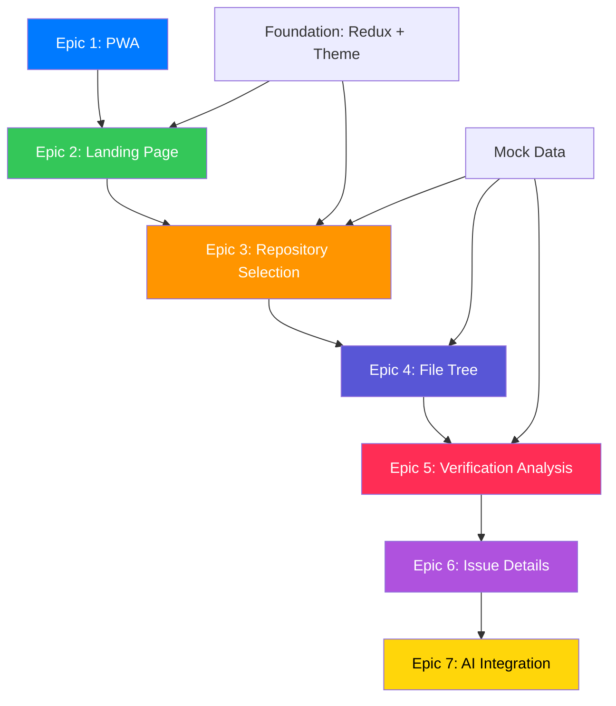

# Epic Traceability Matrix

**Project**: C++ Grinding Mockup - Formal Verification Linter
**Generated**: 2024-12-03
**PRD Version**: 1.0
**Architecture Version**: 1.0
**GitHub Project**: [C++ Grinding Mockup #13](https://github.com/users/o2alexanderfedin/projects/13)

---

## Overview

This document provides complete traceability between Product Requirements (PRD), Technical Architecture, and GitHub Epics. Each Epic represents a complete vertical slice of functionality from UI to data.

---

## Epic Summary

| # | Epic | Priority | Complexity | GitHub Issue | Project Status |
|---|------|----------|------------|--------------|----------------|
| 1 | PWA Installation & Launch Experience | Must-Have | Medium | [#1](https://github.com/o2alexanderfedin/cpp-grinding-mockup/issues/1) | Todo |
| 2 | Landing Page & GitHub Connection Flow | Must-Have | Medium | [#2](https://github.com/o2alexanderfedin/cpp-grinding-mockup/issues/2) | Todo |
| 3 | Repository Selection Dashboard | Must-Have | Low-Medium | [#3](https://github.com/o2alexanderfedin/cpp-grinding-mockup/issues/3) | Todo |
| 4 | File Tree Visualization | Must-Have | Low-Medium | [#4](https://github.com/o2alexanderfedin/cpp-grinding-mockup/issues/4) | Todo |
| 5 | Formal Verification Analysis | Must-Have | High | [#5](https://github.com/o2alexanderfedin/cpp-grinding-mockup/issues/5) | Todo |
| 6 | Issue Investigation & Details | Must-Have | High | [#6](https://github.com/o2alexanderfedin/cpp-grinding-mockup/issues/6) | Todo |
| 7 | AI Agent Integration & Export | Must-Have | Medium | [#7](https://github.com/o2alexanderfedin/cpp-grinding-mockup/issues/7) | Todo |

**Total Epics**: 7
**All Priority**: Must-Have (Critical for demo)

---

## Detailed Traceability

### Epic 1: PWA Installation & Launch Experience

**GitHub Issue**: [#1](https://github.com/o2alexanderfedin/cpp-grinding-mockup/issues/1)
**Epic Type**: Infrastructure
**Priority**: Must-Have
**Complexity**: Medium

#### PRD References
- **Feature 1**: PWA Installation & Launch Experience (PRD.md lines 126-156)
- **User Story**: Landing page with GitHub connection (PRD.md lines 84-91)
- **Success Metric**: Successful installation during demo, zero errors (PRD.md lines 147-150)

#### Architecture References
- **Vertical Slice 1**: Install and Launch App (ARCHITECTURE.md lines 64-93)
- **Implementation Phase 2**: PWA Configuration (ARCHITECTURE.md lines 984-997)
- **PWA Configuration**: Manifest and Service Worker setup (ARCHITECTURE.md lines 713-759)

#### Business Value
Demonstrates technical sophistication and provides professional demo experience that impresses Alchemist investors. Transforms demo from "web page" to "real product."

#### Key Acceptance Criteria
- manifest.json configured with Hupyy branding
- Service worker registered for offline functionality
- Chrome installation successful
- Standalone launch without browser chrome
- Works offline after initial load

---

### Epic 2: Landing Page & GitHub Connection Flow

**GitHub Issue**: [#2](https://github.com/o2alexanderfedin/cpp-grinding-mockup/issues/2)
**Epic Type**: Feature
**Priority**: Must-Have
**Complexity**: Medium

#### PRD References
- **Feature 2**: Landing Page with GitHub Connection Flow (PRD.md lines 159-189)
- **User Story**: Investor understanding product purpose (PRD.md lines 85-91)
- **Success Metric**: Professional visual impression in first 3 seconds (PRD.md lines 182-184)

#### Architecture References
- **Vertical Slice 2**: Connect to GitHub (ARCHITECTURE.md lines 96-131)
- **Implementation Phase 4**: Connect to GitHub (ARCHITECTURE.md lines 1026-1042)
- **Redux Design**: connectionSlice with status enum (ARCHITECTURE.md lines 506-509)
- **Theme**: macOS Aesthetic (ARCHITECTURE.md lines 613-673)

#### Business Value
First impression determines investor confidence. Professional landing page with clear value proposition hooks evaluators within first 3 seconds.

#### Key Acceptance Criteria
- macOS aesthetic (SF Pro font, subtle shadows)
- Hupyy, Inc branding visible
- "AI firewall for code verification" tagline
- "Connect to GitHub" CTA button
- Simulated 1-2 second loading with smooth transition

---

### Epic 3: Repository Selection Dashboard

**GitHub Issue**: [#3](https://github.com/o2alexanderfedin/cpp-grinding-mockup/issues/3)
**Epic Type**: Feature
**Priority**: Must-Have
**Complexity**: Low-Medium

#### PRD References
- **Feature 3**: Simulated Repository Selection Dashboard (PRD.md lines 192-221)
- **User Story**: Development team lead selecting repositories (PRD.md lines 100-105)
- **Success Metric**: Repo names impress evaluators (PRD.md lines 214-216)

#### Architecture References
- **Vertical Slice 3**: Select Repository (ARCHITECTURE.md lines 134-183)
- **Implementation Phase 5**: Select Repository (ARCHITECTURE.md lines 1045-1058)
- **Redux Design**: repositoriesSlice with repositories array (ARCHITECTURE.md lines 511-514)
- **Mock Data**: Repository interface definition (ARCHITECTURE.md lines 154-163, 1006-1020)

#### Business Value
High-profile repository names (Stripe, Meta) impress investors and demonstrate broad applicability to security-critical and performance-critical systems.

#### Key Acceptance Criteria
- Two repos visible: "stripe/payment-gateway" and "meta/compiler-optimizer"
- Repo cards show metadata (language: C++, description, activity)
- Selection triggers smooth transition to repository view
- "Connected to GitHub" status visible

---

### Epic 4: File Tree Visualization

**GitHub Issue**: [#4](https://github.com/o2alexanderfedin/cpp-grinding-mockup/issues/4)
**Epic Type**: Feature
**Priority**: Must-Have
**Complexity**: Low-Medium

#### PRD References
- **Feature 4**: Repository File Tree Display (PRD.md lines 224-253)
- **User Story**: Demo viewer seeing realistic project context (PRD.md lines 100-105)
- **Success Metric**: Looks like real C++ project (PRD.md lines 248-250)

#### Architecture References
- **Vertical Slice 4**: Browse Project Structure (ARCHITECTURE.md lines 186-233)
- **Implementation Phase 6**: Browse Project Structure (ARCHITECTURE.md lines 1061-1073)
- **Component Design**: FileTreeView, FileTreeNode (recursive), FileIcon (ARCHITECTURE.md lines 198-210)
- **Data Structure**: FileNode interface (ARCHITECTURE.md lines 204-210)

#### Business Value
Realistic file structure makes simulation convincing and provides context for where verification issues are found. Demonstrates understanding of real-world C++ projects.

#### Key Acceptance Criteria
- Realistic C++ structure (src/, include/, tests/)
- 10-20 files per repo
- Collapsible folders
- File type icons (.cpp, .h, CMakeLists.txt)
- Files NOT clickable (intentionally out of scope)

---

### Epic 5: Formal Verification Analysis

**GitHub Issue**: [#5](https://github.com/o2alexanderfedin/cpp-grinding-mockup/issues/5)
**Epic Type**: Feature
**Priority**: Must-Have (Core Value Prop)
**Complexity**: High

#### PRD References
- **Feature 5**: Run Analysis Button & Simulated Processing (PRD.md lines 256-288)
- **Feature 6**: Results Display in macOS-Style Drawer (PRD.md lines 291-332)
- **User Story**: Investor seeing bug discovery (PRD.md lines 85-98)
- **Success Metric**: Demonstrates formal verification depth (PRD.md lines 363-367)

#### Architecture References
- **Vertical Slice 5**: Verify Code (Run Analysis) (ARCHITECTURE.md lines 236-277)
- **Implementation Phase 7**: Verify Code (ARCHITECTURE.md lines 1076-1094)
- **Redux Design**: analysisSlice with status and results (ARCHITECTURE.md lines 516-519)
- **Mock Data**: Issue interface with all fields (ARCHITECTURE.md lines 310-325, 1011-1020)
- **Animation**: Framer Motion for drawer (ARCHITECTURE.md lines 677-693)

#### Business Value
Core value proposition demonstration. Shows tool finds serious bugs (memory safety, concurrency, undefined behavior, type safety) with formal proofs, differentiating from traditional linters.

#### Key Acceptance Criteria
- "Run Formal Verification" button with icon
- Realistic 2-5 second loading state
- Results drawer slides in smoothly
- 3-5 issues per repo displayed
- All bug categories represented:
  - Memory safety (buffer overflow, use-after-free, null pointer)
  - Concurrency (race conditions, deadlocks)
  - Undefined behavior (integer overflow, uninitialized variables)
  - Type safety violations
- Color-coded severity, category badges
- Summary header with issue count

---

### Epic 6: Issue Investigation & Details

**GitHub Issue**: [#6](https://github.com/o2alexanderfedin/cpp-grinding-mockup/issues/6)
**Epic Type**: Feature
**Priority**: Must-Have
**Complexity**: High

#### PRD References
- **Feature 7**: Issue Detail Expansion with Comprehensive Views (PRD.md lines 335-375)
- **User Story**: Investor seeing formal verification depth (PRD.md lines 85-98)
- **Success Metric**: Multiple views show value for all audiences (PRD.md lines 364-367)

#### Architecture References
- **Vertical Slice 6**: Investigate Issues (ARCHITECTURE.md lines 280-346)
- **Implementation Phase 8**: Investigate Issues (ARCHITECTURE.md lines 1097-1114)
- **Component Design**: IssueDetailModal with tabs (ARCHITECTURE.md lines 296-334)
- **Redux Actions**: selectIssue, clearSelection (ARCHITECTURE.md lines 306-309)
- **Syntax Highlighting**: Prism.js or highlight.js (ARCHITECTURE.md lines 336-339)

#### Business Value
Differentiates from traditional linting by showing actual formal proofs. Multiple views serve both technical and non-technical audiences. Actionable fixes prove practical value.

#### Key Acceptance Criteria
- Issue click opens detail modal
- Five tabs/sections:
  - **Code**: C++ snippet with syntax highlighting
  - **Formal Proof**: SMT-LIB/cvc5 syntax (plausible)
  - **Proof Visualization**: Simplified symbolic representation
  - **Explanation**: Human-readable, non-jargon description
  - **Fix**: Suggested code fix with before/after
- "Verified by cvc5" badge prominent
- Smooth modal animation (scale + fade, 200ms)

---

### Epic 7: AI Agent Integration & Export

**GitHub Issue**: [#7](https://github.com/o2alexanderfedin/cpp-grinding-mockup/issues/7)
**Epic Type**: Feature
**Priority**: Must-Have (Differentiator)
**Complexity**: Medium

#### PRD References
- **Feature 8**: AI Agent Integration Features (PRD.md lines 377-425)
- **User Story**: Team lead exporting for AI agents (PRD.md lines 106-112)
- **Success Metric**: "AI firewall" positioning clear (PRD.md lines 419-422)

#### Architecture References
- **Vertical Slice 7**: Export for AI Integration (ARCHITECTURE.md lines 349-394)
- **Implementation Phase 9**: Export for AI Integration (ARCHITECTURE.md lines 1117-1134)
- **Component Design**: ExportButton, JsonExportModal, MetricCard (ARCHITECTURE.md lines 366-377)
- **Redux Selectors**: selectTotalIssueCount (derived) (ARCHITECTURE.md lines 545-548)
- **Utilities**: jsonSerializer.ts (ARCHITECTURE.md lines 1236)

#### Business Value
Clear differentiation and positioning. "AI firewall" messaging resonates with current AI code generation trend. Export functionality proves practical integration value.

#### Key Acceptance Criteria
**Export Button**:
- "Export for AI Agent" button on issue details
- Modal shows formatted JSON with all fields
- JSON syntax-highlighted
- Copy to clipboard works (Clipboard API)
- Explanation text about AI agent integration

**Dashboard Metric**:
- Metric card visible in results header
- "Blocked X AI-Generated Bugs" displayed
- Subtitle about formal verification
- Shield icon with success color
- Count derived from total issues

---

## Implementation Order

Based on dependencies and risk mitigation:

1. **Phase 1-2**: Foundation + PWA (Epic 1) - 3 hours
2. **Phase 3**: Mock Data - 2 hours
3. **Phase 4**: Landing & Connection (Epic 2) - 2 hours
4. **Phase 5**: Repository Selection (Epic 3) - 2 hours
5. **Phase 6**: File Tree (Epic 4) - 1.5 hours
6. **Phase 7**: Verification Analysis (Epic 5) - 3 hours
7. **Phase 8**: Issue Details (Epic 6) - 3 hours
8. **Phase 9**: AI Integration (Epic 7) - 1.5 hours
9. **Phase 10**: Polish & Testing - 2 hours

**Total Estimated Time**: ~22 hours (2 days with AI-assisted development)

---

## Cross-Epic Dependencies

---

## PRD → Architecture → Epic Mapping

| PRD Feature | Architecture Slice | Epic | GitHub Issue |
|-------------|-------------------|------|--------------|
| Feature 1: PWA Installation (lines 126-156) | Slice 1: Install and Launch (lines 64-93) | Epic 1 | [#1](https://github.com/o2alexanderfedin/cpp-grinding-mockup/issues/1) |
| Feature 2: Landing Page (lines 159-189) | Slice 2: Connect to GitHub (lines 96-131) | Epic 2 | [#2](https://github.com/o2alexanderfedin/cpp-grinding-mockup/issues/2) |
| Feature 3: Repository Selection (lines 192-221) | Slice 3: Select Repository (lines 134-183) | Epic 3 | [#3](https://github.com/o2alexanderfedin/cpp-grinding-mockup/issues/3) |
| Feature 4: File Tree Display (lines 224-253) | Slice 4: Browse Project Structure (lines 186-233) | Epic 4 | [#4](https://github.com/o2alexanderfedin/cpp-grinding-mockup/issues/4) |
| Feature 5: Run Analysis (lines 256-288) | Slice 5: Verify Code (lines 236-277) | Epic 5 | [#5](https://github.com/o2alexanderfedin/cpp-grinding-mockup/issues/5) |
| Feature 6: Results Display (lines 291-332) | Slice 5: Verify Code (lines 236-277) | Epic 5 | [#5](https://github.com/o2alexanderfedin/cpp-grinding-mockup/issues/5) |
| Feature 7: Issue Details (lines 335-375) | Slice 6: Investigate Issues (lines 280-346) | Epic 6 | [#6](https://github.com/o2alexanderfedin/cpp-grinding-mockup/issues/6) |
| Feature 8: AI Integration (lines 377-425) | Slice 7: Export for AI (lines 349-394) | Epic 7 | [#7](https://github.com/o2alexanderfedin/cpp-grinding-mockup/issues/7) |

---

## Success Criteria Coverage

### PRD Success Metrics → Epic Coverage

| Success Metric (PRD Section 6) | Covered By Epic |
|--------------------------------|-----------------|
| Alchemist evaluators express interest | All Epics (complete demo) |
| Zero visual bugs or UI glitches | All Epics |
| Technical credibility demonstrated | Epic 1 (PWA), Epic 5 (Verification), Epic 6 (Proofs) |
| "AI firewall" concept understood | Epic 7 (AI Integration) |
| Demo completes without interruption | All Epics |
| PWA install successful | Epic 1 |
| Smooth animations | Epic 2, 5 (drawer), 6 (modal) |
| No console errors | All Epics |

---

## Architecture Principles Coverage

| Principle | Applied In Epics |
|-----------|------------------|
| **Vertical Slices** | All 7 Epics (each is complete user flow) |
| **SOLID** | All Epics (component boundaries, Redux separation) |
| **KISS** | Epic 1 (Workbox), Epic 2-7 (Material-UI) |
| **DRY** | Epic 5-7 (Redux selectors, shared components) |
| **YAGNI** | All Epics (no localStorage, dark mode, mobile) |
| **TRIZ-IFR** | Epic 1 (PWA tooling), Epic 6 (syntax highlighting) |
| **Type Safety** | All Epics (TypeScript strict mode) |

---

## GitHub Project Integration

**Project**: [C++ Grinding Mockup #13](https://github.com/users/o2alexanderfedin/projects/13)

All 7 Epics have been:
- ✅ Created as GitHub Issues with complete descriptions
- ✅ Added to Project #13
- ✅ Tagged with Type="Epic" field
- ✅ Set to Status="Todo" (ready for implementation)
- ✅ Linked to PRD and Architecture documents

### Project Fields
- **Type**: Epic (all 7 items)
- **Status**: Todo (all 7 items)
- **Priority**: Available (Critical/High/Medium/Low)
- **Effort**: Available (XS/S/M/L/XL)

---

## Next Steps

1. **Review Epics**: Validate all 7 epics with team
2. **Begin Implementation**: Start with Epic 1 (Foundation + PWA)
3. **Track Progress**: Update Epic status in Project #13 as work progresses
4. **Create User Stories**: Break each Epic into User Stories (optional, can be done during sprint planning)
5. **Create Tasks**: Break User Stories into implementation tasks

---

## Document Control

| Version | Date | Author | Changes |
|---------|------|--------|---------|
| 1.0 | 2024-12-03 | Claude (prd-to-epics skill) | Initial traceability matrix generated from PRD v1.0 and Architecture v1.0 |

---

**Generated by**: prd-to-epics skill
**Based on**: PRD v1.0 (2024-12-02), Architecture v1.0 (2024-12-02)
**Repository**: https://github.com/o2alexanderfedin/cpp-grinding-mockup
**GitHub Project**: https://github.com/users/o2alexanderfedin/projects/13
